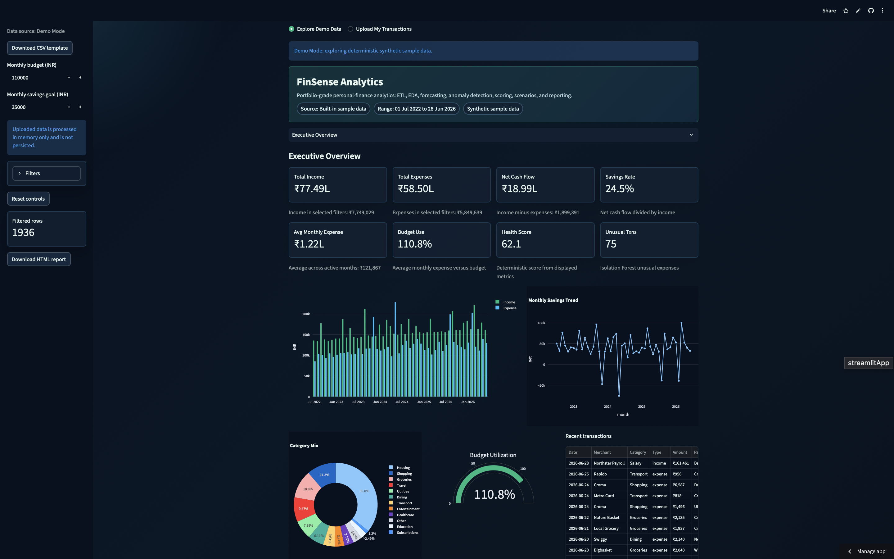
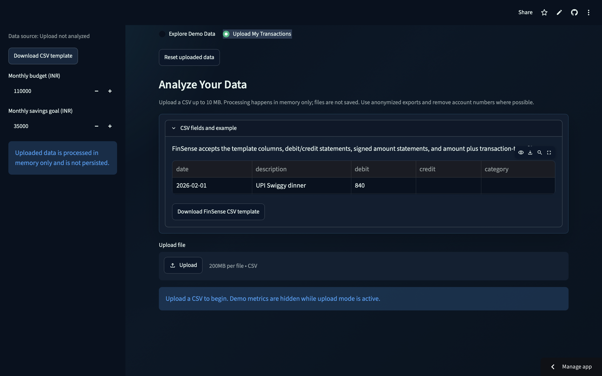
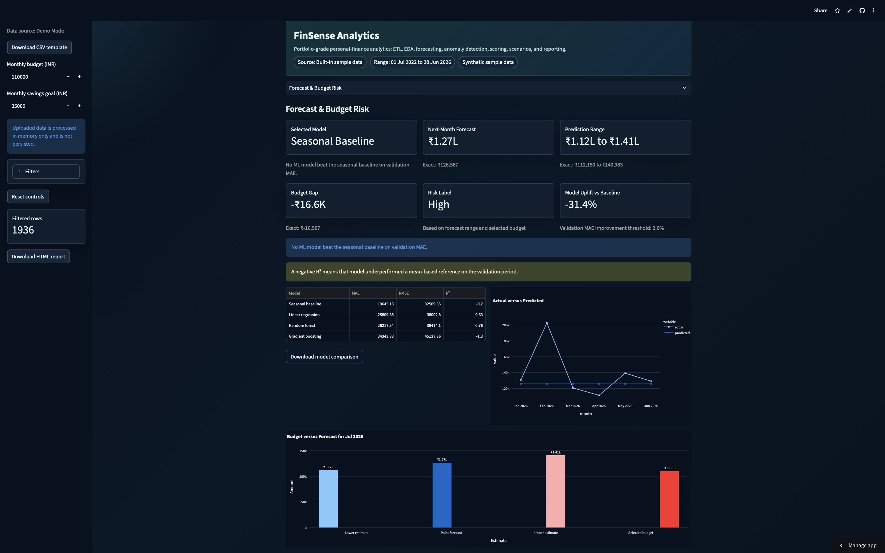
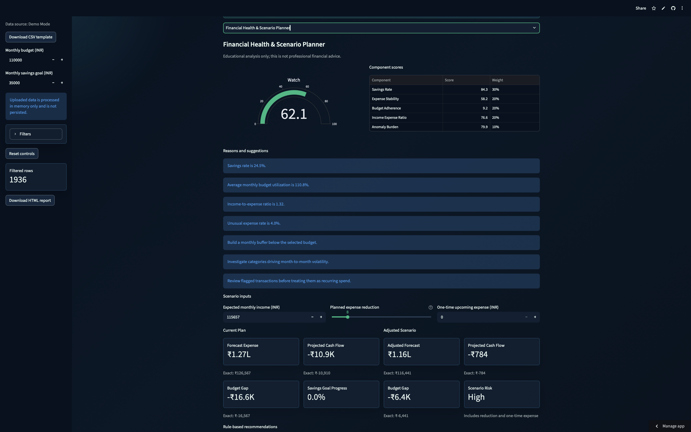

# FinSense Analytics

FinSense Analytics is a compact, portfolio-grade Streamlit data science project for INR personal-finance analytics. It supports deterministic synthetic demo data and user-uploaded CSV transactions, then runs validation, ETL, exploratory analysis, chronological forecasting, anomaly detection, financial scoring, scenario planning, and downloadable reporting.

This is an educational analytics project, not enterprise production software or professional financial advice.

## Live Demo

[https://finsense-analytics-4ryxn.streamlit.app](https://finsense-analytics-4ryxn.streamlit.app)

## Features

- **Demo Data mode:** explore deterministic synthetic transactions with salary growth, inflation, recurring merchants, seasonality, and controlled unusual expenses.
- **Upload My Transactions:** analyze personal CSV exports through a main-area five-step import wizard.
- **Flexible CSV support:** FinSense template, debit/credit bank statements, signed-amount CSVs, and amount plus transaction-type files.
- **Import assistance:** automatic column detection, manual column mapping, preview before analysis, and clear validation messages.
- **Deterministic enrichment:** merchant and category inference from descriptions using transparent keyword rules, never AI categorization.
- **ETL and data quality:** schema validation, cleaning, duplicate removal, rejected-row reasons, missing-value handling, and cleaning-report download.
- **EDA and statistics:** KPIs, trends, category and merchant analysis, calendar patterns, distributions, boxplots, percentiles, growth, and concentration.
- **Forecasting:** leakage-safe chronological evaluation with a seasonal baseline benchmark, Linear Regression, Random Forest, Gradient Boosting, residual-derived prediction ranges, and feature importance.
- **Anomaly detection:** deterministic Isolation Forest scoring with severity labels and factual explanations. Anomalies mean unusual patterns, not fraud.
- **Financial Health Score:** transparent 0-100 score with component weights, reasons, and suggestions.
- **Scenario Planner:** estimate budget gap, projected cash flow, savings-goal progress, and risk after planned changes.
- **Downloads:** cleaned transactions CSV, cleaning report, anomalies CSV, monthly summary CSV, model comparison CSV, and a self-contained HTML report.

## Analyze Your Own Data

Choose **Upload My Transactions** at the top of the app. Demo metrics stay hidden until an uploaded file is confirmed.

The import wizard runs in the main content area:

1. Upload file
2. Detect columns
3. Review mapping
4. Preview cleaned data
5. Analyze

Supported CSV layouts:

- Existing FinSense template
- Separate debit and credit columns, where debit becomes expense and credit becomes income
- One signed amount column, where negative values become expenses and positive values become income
- Amount plus transaction-type column

Recognized column names include common variations of `date`, `transaction_date`, `value_date`, `description`, `narration`, `details`, `remarks`, `debit`, `withdrawal`, `credit`, `deposit`, `amount`, `transaction_type`, `type`, `category`, `merchant`, `payment_method`, `currency`, and `transaction_id`.

If automatic detection is incomplete, the wizard provides mapping controls for required and optional fields. Balance columns and unknown unnecessary columns are ignored.

When merchant or category is missing, FinSense derives a merchant from the transaction description and applies deterministic keyword rules. Examples: Swiggy or Zomato become Dining, rent becomes Housing, Airtel/Jio/gas/power become Utilities, Netflix/Spotify/Prime become Subscriptions, and low-confidence descriptions become Other.

## Screenshots

### Executive Overview



### Real Transaction Import



### Expense Forecast and Budget Risk



### Financial Health and Scenario Planner



## Privacy

- Uploaded files are processed in memory only.
- Uploaded files are not saved or persisted.
- CSV files over 10 MB are rejected.
- Empty, malformed, and unsupported CSVs receive safe validation messages.
- The app does not log transaction contents.
- Users should upload anonymized exports and remove full account numbers before analysis.

## Data Science Lifecycle

1. Ingest demo or uploaded CSV data.
2. Detect, map, and normalize transaction columns.
3. Validate required fields and critical values.
4. Clean dates, amounts, transaction types, categories, merchants, and payment methods.
5. Transform transactions into monthly analytical and modeling features.
6. Explore trends, distributions, categories, merchants, and calendar behavior.
7. Evaluate forecasting models chronologically without target leakage.
8. Detect unusual expense transactions with Isolation Forest.
9. Score financial health and run scenario analysis.
10. Generate CSV and HTML reports.

## Architecture / Project Structure

- `app.py`: Streamlit entry point, data-source selection, import wizard orchestration, dashboard routing
- `src/finsense/imports.py`: CSV parsing, column detection, mapping validation, deterministic merchant/category enrichment
- `src/finsense/etl.py`: validation, cleaning, duplicate handling, cleaning report
- `src/finsense/analytics.py`: KPIs, filters, monthly summaries, EDA aggregations, CSV export helpers
- `src/finsense/features.py`: leakage-safe monthly features, lags, rolling averages, cyclical month features
- `src/finsense/forecasting.py`: seasonal baseline, ML models, chronological validation, 2% uplift rule, residual ranges, importance
- `src/finsense/anomalies.py`: deterministic Isolation Forest pipeline and severity labels
- `src/finsense/scoring.py`: Financial Health Score components, weights, bands, reasons, suggestions
- `src/finsense/scenarios.py`: scenario-planner calculations
- `src/finsense/insights.py`: deterministic insights and recommendations
- `src/finsense/reporting.py`: cleaning-report CSV and escaped HTML report generation
- `src/finsense/ui.py`: Streamlit and Plotly presentation helpers
- `scripts/generate_sample_data.py`: deterministic synthetic sample-data generator
- `tests/`: automated coverage for ETL, imports, analytics contracts, forecasting, anomalies, scoring, scenarios, reporting, and sample generation

## Dataset Schema

FinSense normalized transactions use these required columns:

- `date`: parseable transaction date
- `transaction_type`: `income` or `expense`
- `category`: transaction category
- `merchant`: merchant or counterparty name
- `amount`: positive numeric INR amount
- `payment_method`: payment method or channel

Optional:

- `transaction_id`: used for deterministic duplicate handling when present

The built-in sample dataset is deterministic, synthetic, and non-sensitive.

## Forecasting Methodology

Expenses are aggregated monthly. Features used to predict month `t` are available strictly before month `t`, including previous-month income, savings, savings rate, transaction frequency, expense growth, expense lags, rolling expense averages, merchant/category diversity, weekend ratio, and cyclical month encodings.

The seasonal baseline is the required benchmark. Linear Regression, Random Forest, and Gradient Boosting are evaluated chronologically and selected by validation MAE, not R². An ML model is selected only when it improves validation MAE by at least 2% versus the seasonal baseline; otherwise the app prefers the simpler baseline and reports that ML provided no material uplift.

Prediction ranges are derived from historical validation residuals. They are not guaranteed confidence intervals. Negative R² is displayed honestly and means a model underperformed a mean-based reference on the validation period.

## Anomaly Methodology

Expense transactions are scored with a deterministic scikit-learn Isolation Forest pipeline using scaled numeric features and encoded category, merchant, payment-method, and time features. Severity labels come from anomaly-score quantiles. Anomaly means unusual relative to the dataset, not fraudulent.

## Health-Score Methodology

The Financial Health Score is deterministic and educational. Components are scored from 0 to 100 and combined with these weights:

- Savings rate: 30%
- Expense stability: 20%
- Budget adherence: 20%
- Income-to-expense ratio: 20%
- Anomaly burden: 10%

Bands are Strong, Stable, Watch, and At Risk. The app explains score drivers and suggestions but does not provide professional financial advice.

## Local Setup

```bash
python -m venv .venv
source .venv/bin/activate
python -m pip install --upgrade pip
python -m pip install -r requirements-dev.txt
python scripts/generate_sample_data.py
streamlit run app.py
```

## Tests

Current automated validation: **29 tests passing**.

```bash
python -m ruff format --check .
python -m ruff check .
python -m pytest
```

## Deployment

Deploy to Streamlit Community Cloud with `app.py` as the entry point and `requirements.txt` as the dependency file. The app does not require a database, authentication, Docker, external image assets, paid APIs, LLM APIs, OCR, or background services.

## Limitations

- Educational portfolio project, not enterprise production software
- CSV uploads only; no OCR, PDF bank statements, or spreadsheet import
- No authentication or persistent user storage
- Forecasts are estimates and may underperform on filtered or short histories
- Prediction ranges are validation-residual ranges, not formal confidence intervals
- Anomaly flags indicate unusual patterns, not fraud
- Rule-based category inference is deterministic and may require user review

## Future Improvements

- Optional saved local mapping presets without persisting transaction data
- More user-controlled anomaly sensitivity
- Additional walk-forward validation visualizations
- HTML-to-PDF report export
- Broader bank-statement examples in documentation

## Responsible Use

FinSense Analytics is not professional financial advice. Use it to explore data quality, analytics, and modeling techniques on deterministic synthetic data or transaction data you own and are comfortable uploading for in-memory analysis.
